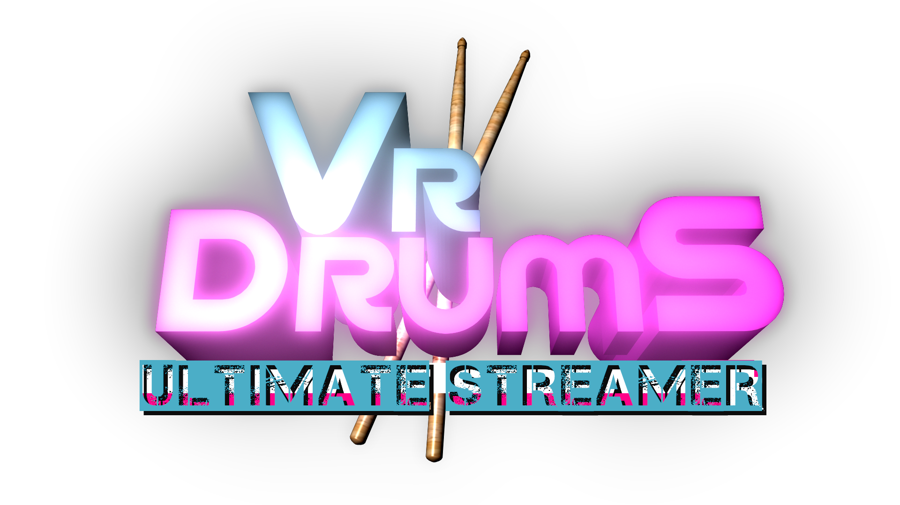

░░░░░**Operations**░░░░░░░░░░░░░░░░░░░░░░░░░░░░░░░░░░░░░░░░░

Select VR Drums Ultimate Steamer from your library in
Steam. Select PLAY and the launch options for the game
will launch. Put your VR unit on your head and launch 
the game. Center yourself in your play area. The game 
will start.

░Launch Options

Default 
**Lauanch with no VR.

Launch Ocuulus SDK App 
**The option you want to use when using an Oculus VR
headset.

Launch with OpenXR device support (Vive)(Beta testing)
**For testing with the Vive VR headset.

Launch with OpenXR application (Vive)(Beta testing)
**For testing with the Vive VR headset.

░░░░░**Player Positioning**░░░░░░░░░░░░░░░░░░░░░░░░░░░░░░░░░

Use your VR controllers to position yourself. The 
posistioning controls are listed below.

░Position Forward (Right 2D axis click)
░Position Back (Left 2D axis click)
░Position Higher (Left primary button)
░Position Lower (Left second primary button)

░░░░░**Extended Controls**░░░░░░░░░░░░░░░░░░░░░░░░░░░░░░░░░░

░Keyboard
**Kick Hi-hat (K key)
**Kick Bass (Space key)

░Gamepad
**Kick Bass (Button 2/3) South/East [XBOX, A,B][PS X,O]
**Kick Hi-hat (Button 4/5) North/West [XBOX, X, Y][PS
Square, Triangle]

░Mouse
**Kick Bass (Left click)
**Kick Hi-hat (Right click)

░░░░░**Foot pedals**░░░░░░░░░░░░░░░░░░░░░░░░░░░░░░░░░░░░░░░

Third party tools that could help you create, use and
configure your external foot pedal or device for use
with the hi-hat or bass pedal.

░reWASD joystick mapper
░JoyToKey

░░░░░**EDIT MODE**░░░░░░░░░░░░░░░░░░░░░░░░░░░░░░░░░░░░░░░░░░

Entering EDIT MODE will allow you to move the position
of your drums. When you enter EDIT MODE you will see
orange and blue boxes appear on your drumkit.

░Enter EDIT MODE (Left primary button)
░Exit EDIT MODE (Left primary button)
░Grab Drum (Right grip trigger)

░░░░░**Moving a Drum**░░░░░░░░░░░░░░░░░░░░░░░░░░░░░░░░░░░░░░

To move a drum location press (Left primary button) to
enter EDIT MODE. Grab the orange cube of the drum you
want to move with your right hand and pull the (Right
grip trigger) to set the new location. Wait for the
orange cube to resize and lock the drum into place. The
drum is now locked in place. Tap (Left primary button)
to exit EDIT MODE.

░░░░░**Change an Instrument**░░░░░░░░░░░░░░░░░░░░░░░░░░░░░░░

To change a drum press the (Left primary button) to enter
EDIT MODE. Hold your left hand over the blue cube of the
drum you wish to change. The drums menu will appear.
Choose your drum from the selection with your right hand
laser pointer. Remove your left hand from blue cube to
exit the drums menu. Press the (Left primary button)
again to leave EDIT MODE.

░░░░░**Streaming**░░░░░░░░░░░░░░░░░░░░░░░░░░░░░░░░░░░░░░░░░░

To capture with OBS, right click the source and make
sure the capture method is set to Windows 10 (1903 and
up). Tracking performance is everything and streaming
at high bitrates can cause tracking performance to dip.
Make sure to configure your settings acordingly if you 
are low on system resources.

░░░░░**Display**░░░░░░░░░░░░░░░░░░░░░░░░░░░░░░░░░░░░░░░░░░░░

VRDUS will launch fullscreen. To minimize VRDUS into a
moveable desktop window press Alt + Enter while in game.

░░░░░**MIDI**░░░░░░░░░░░░░░░░░░░░░░░░░░░░░░░░░░░░░░░░░░░░░░░

To have VR Drums Ultimate Streamer communicate to an internal MIDI synthesizer (Windows comes with a MIDI synthesizer build into it: the Microsoft GS Wavetable synth) or with external hardware like a synthesizer using MIDI, connected to Windows. Launch the MidiBridge.exe file located in VRDUS root installation folder.

Once loaded MidiBridge.exe will scan Windows OS for any connected MIDI synthesizer or devices running on Windows or connected to Windows using Windows MIDI and reconize it under DEVICE NAME.

**In this case an internal software MIDI synthesizer that comes standard and built into Windows OS. The Microsoft GS Wavetable Synth.

It's now waiting for a connection from a MIDI controller, we will use VR Drums Ultimates Streamer as the controller.

Now launch VR Drums Ultimate Streamer. MIDIBridge.exe will accept the connection from VR Drums Ultimate Streamer.

Example of a hit in VR Drums Ultimate Streamer being processed in MIDIBridge.exe

Detail MIDI information is listed below for customizing the sounds VR Drums Ultimate Streamer makes.

**MIDI Detail**

snare --ch1 Note#48

tom1 --ch1 Note#47

tom2 --ch1 Note#46

tom3 --ch1 Note#45

tom4 --ch1 Note#44

ride2 --ch1 Note#43

ride2bell --ch1 Note#42

ride1 --ch1 Note#41

ride1bell --ch1 Note#40

crash2 --ch1 Note#39

crash1 --ch1 Note#38

splash6 --ch1 Note#37

splash8 --ch1 Note#36

splash10 --ch1 Note#35

cow3 --ch1 Note#34

cow2 --ch1 Note#33

cow2 --ch1 Note#32

bass --ch1 Note#31

highHat CloseTap --ch1 Note#30

highHat Open Strike Hit --ch1 Note#29

highHat Closed Strike Hit --ch1 Note#28

highHat Quick Relase --ch1 Note#27

dry Crash --ch1 Note#26

china Crash --ch1 Note#25

░░░░░**MISC**░░░░░░░░░░░░░░░░░░░░░░░░░░░░░░░░░░░░░░░░░░░░░░░

Available on Steam💾
https://store.steampowered.com/app/2354400/

Project💾
https://github.com/AlienCyberCoat/VR-Drums-Ultimate-Streamer

YouTube
https://www.Youtube.com/@AlienCyberCoat

